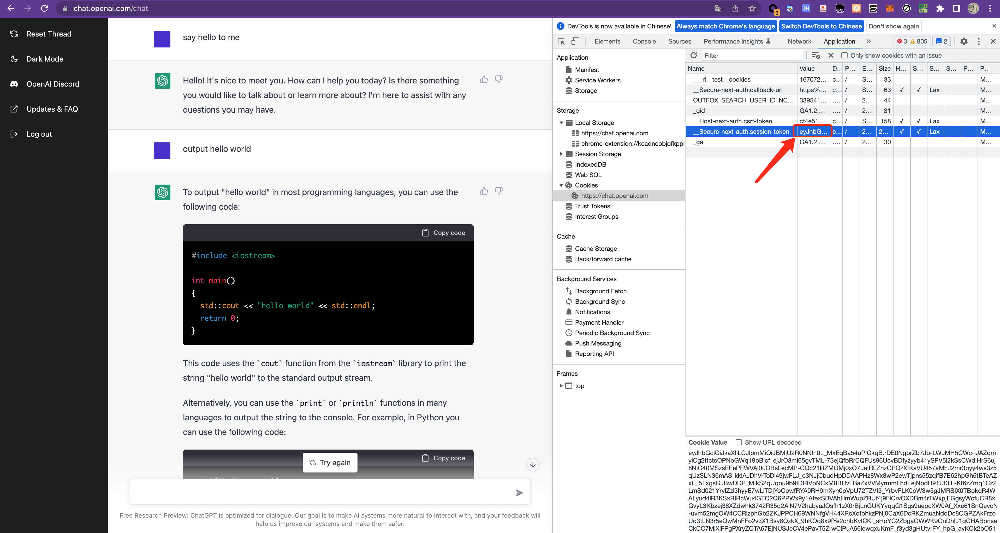

# chatgpt-go

chatgpt sdk writen with golang.

## Rrecondition

you should login [ChatGPT website](https://chat.openai.com/chat), and get your session-token



## Quick Start

1. install chatgpt-go sdk

```shell
go get -u github.com/chatgp/chatgpt-go
```

2. chat in independent conversation

```go
package main 

import (
    "fmt"
	"time"

	chatgpt "github.com/chatgp/chatgpt-go"
)

func main() {
    // new chatgpt client
    token := `YOUR-SESSION-TOKEN`
	cli = chatgpt.NewClient(
		chatgpt.WithToken(token),
		chatgpt.WithTimeout(30*time.Second),
	)

    // chat in independent conversation
    message := "hello"
	text, err := cli.GetChatText(message)
	if err != nil {
		log.Fatalf("get chat text failed: %v", err)
	}
	fmt.Printf("q: %s, a: %s\n", message, text.Content)
}
```

3. chat in continuous conversation

```go
package main 

import (
    "fmt"
	"time"

	chatgpt "github.com/chatgp/chatgpt-go"
)

func main() {
    // new chatgpt client
    token := `YOUR-SESSION-TOKEN`
	cli = chatgpt.NewClient(
		chatgpt.WithToken(token),
		chatgpt.WithTimeout(30*time.Second),
	)

    // chat in continuous conversation

	// first message
    message := "what's golang"
	text, err := cli.GetChatText(message)
	if err != nil {
		log.Fatalf("get chat text failed: %v", err)
	}
	fmt.Printf("q: %s, a: %s\n", message, text.Content)

	// continue conversation with new message
	conversationID := text.ConversationID
	parentMessage := text.MessageID
	newMessage := "use it to write hello world"

	newText, err := cli.GetChatText(newMessage, conversationID, parentMessage)
	if err != nil {
		log.Fatalf("get chat text failed: %v", err)
	}
	fmt.Printf("q: %s, a: %s\n", newMessage, newText.Content)
}
```

> if you want to start a new conversation out of current conversation, you don't need to reset the client. just remove the `conversationID`、`parentMessage` arguments in `GetChatText` method and use it to get a new text reply.

## Communication

- Telegram Group: [ChatGPT Creators](https://t.me/+YkEGeRxB5Q0zODY1)
- Wechat Group: [ChatGPT Creators](https://work.weixin.qq.com/gm/66944e9bd30628e9270c980bc756663d)